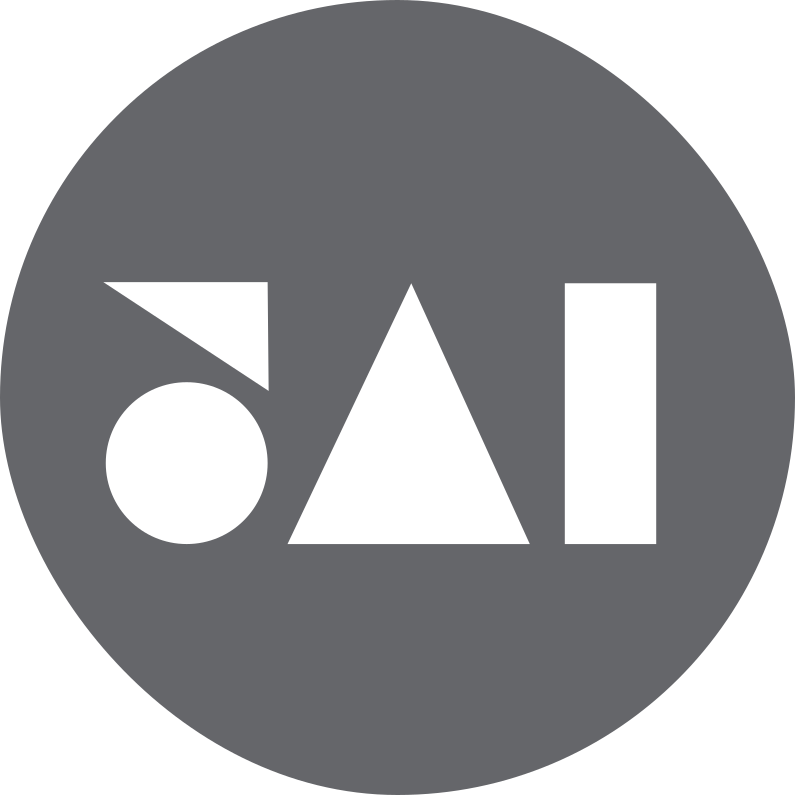

  
  <h1>Elvan Parthasarathy (Jaiprakash P)</h1>
  
Final-year ECE student with full-stack development experience across React, TypeScript, and native Android (Kotlin).

  
  

    
    &nbsp;&nbsp;
    
    &nbsp;&nbsp;
    
    &nbsp;&nbsp;
    
  

 

## About Me

> I am a final-year Electronics and Communication Engineering student interested in software development and application design. Through my academic and personal projects, I have built web and Android applications while gaining practical experience with modern development tools and technologies.

---

## Technical Skills

*   **Languages & Frameworks:** HTML, CSS, React, TypeScript, Java (Basics), C++ (Basics), Python (Basics)
*   **Databases & DevOps:** NoSQL Database, SQL, Git, GitHub, Vercel
*   **Networking & Professional:** Computer Networks, Internet of Things (IoT), Digital Electronics, Sensors & Actuators, UI/UX Design, Technical Writing, Team Collaboration

---

## Featured Projects

### 1. [Neram — Full-Stack Academic Management System](https://github.com/elvanparthasarathy/neram)
*Designed and built a multi-platform academic management system with a React web app, Android app, and role-based admin dashboard.*
*   Implemented authentication, role-based access control (RBAC), real-time NoSQL synchronization, and academic content management.
*   Developed Elvan Agazhi, an OCR-assisted workflow that converts academic calendar PDFs into structured digital records. 
*   Deployed the web application on Vercel, with the Android application published on Google Play.
*   **Tech Stack:** React • JavaScript • Kotlin • NoSQL Database • Git • Vercel

### 2. [Elvan Portfolio OS — Interactive Operating System Portfolio](https://github.com/elvanparthasarathy/ElvanPortfolioOs)
*Designed and built an operating system-inspired portfolio with independent Desktop and Mobile experiences.*
*   Developed a custom window management system with draggable, resizable, minimize/maximize windows, and dynamic taskbar interactions.
*   Integrated projects, certifications, documents, and utilities into a unified interactive workspace.
*   **Tech Stack:** React • TypeScript • Git • Vercel • NoSQL Database

### 3. [Elvan Navil — Multilingual Digital Publishing & CMS](https://github.com/elvanparthasarathy/elvan-navil)
*Designed a multilingual digital publishing platform with a bilingual (Tamil/English) user interface and integrated Content Management System (CMS).*
*   Built a modular content management architecture supporting rich-text editing, real-time synchronization, and dynamic routing.
*   **Tech Stack:** React • TypeScript • NoSQL Database • Git • Vercel

---

## Achievements & Presentations

*   **COULOMB 2025 (2nd Prize):** Paper Presentation on Piezoelectric Material-Based Instant Charging System for EVs.
*   **KalaQuest, IIT Madras:** Finalist; Business Pitch on Preserving Endangered Indian Crafts.
*   **ARTC-23 National Conference:** Paper Presentation on Electric Vehicles: Pioneering a World of Sustainable Transportation.

 

  

